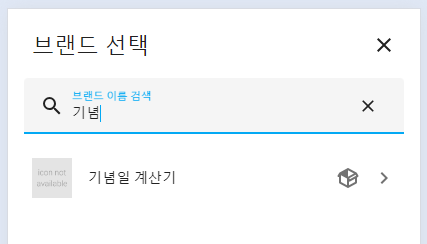
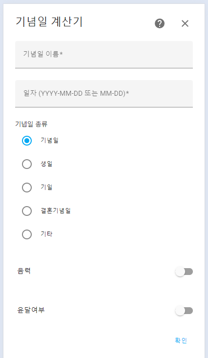
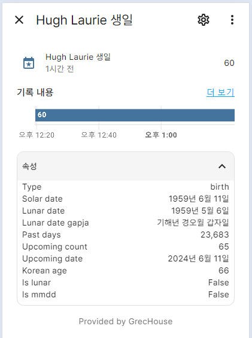

# Anniversary Calculator Sensor for Home Assistant

> 🔥 https://github.com/GrecHouse/anniversary 의 통합구성요소 버전입니다.\
TTS 센서, 장보기 목록 등 일부 기능이 제거되었습니다. 이 기능이 필요하신 분은 기존 버전을 사용하시기 바랍니다.

홈어시스턴트 커스텀 컴포넌트입니다.\
기념일 D-Day를 센서로 알려줍니다.
- 음력을 지원합니다.
- 등록된 기념일의 양력, 음력을 변환하여 속성값으로 알려줍니다.
- 다가올 기념일 날짜도 알려줍니다.
- 기념일에서 현재 날짜까지의 일자 카운트도 알려줍니다.
- [Lovelace UI 커스텀 카드](https://github.com/GrecHouse/anniversary-lovelace-card)를 이용할 수 있습니다.

## Version history
| Version | Date        |               |
| :-----: | :---------: | ------------- |
| v2.0    | 2024.04.12  | 통합구성요소로 변경 |

 

## Installation

### _My Home Assistant_ HACS로 설치
- 아래 링크를 클릭해서 이동 후 다운로드 버튼을 눌러 설치하세요.
- 다운로드 후 Home Assistant를 재시작합니다.

### HACS 설정을 통한 설치
- HACS > Integrations 메뉴 선택
- 우측 상단 메뉴 버튼 클릭 후 Custom repositories 선택
- Add Custom Repository URL 에 `https://github.com/GrecHouse/anniversary-calculator` 입력, \
  Category에 `Integration` 선택 후 ADD
- HACS > Integrations 메뉴에서 우측 하단 + 버튼 누르고 `[KR] Anniversary Calculator Sensor` 검색하여 설치
- Home Assistant 를 재시작합니다.

### 직접 설치
- HA 설치 경로 아래 custom_components 에 anniversary-calculator 폴더를 모두 그대로 넣어줍니다.
- configuration.yaml 파일에 설정을 추가합니다.
- Home Assistant 를 재시작합니다.

 

## Usage

### configuration
- 설정 > 기기 및 서비스 > 통합구성요소 추가하기
- `기념일` 등으로 검색해서 추가하세요.

### 기념일 종류
- `생일` 을 선택할 경우 한국 나이 (Korean Age) 속성이 추가됩니다.
- 종류에 따라 아이콘이 다르게 보입니다.

### 속성값
- `type` : 기념일 타입 ('anniversary': '기념일',
    'birth': '생일',
    'memorial': '기일',
    'wedding': '결혼기념일',
    'etc': '기타')
- `solar_date` : 양력 변환 날짜
- `lunar_date` : 음력 변환 날짜
- `lunar_date_gapja` : 음력 갑자 형식
- `past_days` : 오늘까지의 지난 날짜 일수
- `upcoming_count` : 다가올 기념일의 연간 카운트
- `upcoming_date` : 다가올 기념일 날짜
- `korean_age` : 한국식 나이
- `is_lunar` : 음력 여부
- `is_mmdd` : MM-DD 형식 여부

 

## 음력 처리는 korean-lunar-calendar 라이브러리를 이용합니다.
- https://pypi.org/project/korean-lunar-calendar/

 

## 버그 또는 문의사항
네이버 카페 [HomeAssistant](https://cafe.naver.com/koreassistant/) `그렉하우스`
